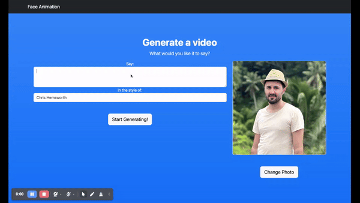

# AI Text Prompt to Video Face Animation



- Developed a face animation pipeline using MakeItTalk Adobe research Python scripts with pre-trained models.
- Adjusted model inference from CUDA to CPU for broader hardware compatibility, so it's available on MacOS
- Built a NodeJS server and HTML frontend that processes user prompts, enhances them via GPT to match styles like Chris Hemsworth or Kim Kardashian, and converts them to audio using AWS Polly.
- Integrated a seamless workflow where audio is fed into the model to generate real-time face animations.

## Requirements

- Install conda for your OS, then create a new conda environment:

```
conda env create --name face_anim --file=environment.yml
```

- Activate the conda env:

```
conda activate face_anim
```

- Run setup to download the pre-trained models:

```
sh setup.sh
```

- ffmpeg (https://ffmpeg.org/download.html)

```
sudo apt-get install ffmpeg
```

- python packages

```
pip install -r requirements.txt
```

- node packages

```
npm i
```

## Dockerfile

There is a dockerfile, if you wish to create a complete image with all the needed libraries, and makes it much easier for you.

## Pre-trained Models

Download the following pre-trained models to `examples/ckpt` folder for testing your own animation. (if you followed the previous step of setup.sh you don't need to do this again)

|               Model               |                                     Link to the model                                      |
| :-------------------------------: | :----------------------------------------------------------------------------------------: |
|         Voice Conversion          | [Link](https://drive.google.com/file/d/1ZiwPp_h62LtjU0DwpelLUoodKPR85K7x/view?usp=sharing) |
|       Speech Content Module       | [Link](https://drive.google.com/file/d/1r3bfEvTVl6pCNw5xwUhEglwDHjWtAqQp/view?usp=sharing) |
|       Speaker-aware Module        | [Link](https://drive.google.com/file/d/1rV0jkyDqPW-aDJcj7xSO6Zt1zSXqn1mu/view?usp=sharing) |
|  Image2Image Translation Module   | [Link](https://drive.google.com/file/d/1i2LJXKp-yWKIEEgJ7C6cE3_2NirfY_0a/view?usp=sharing) |
| Non-photorealistic Warping (.exe) | [Link](https://drive.google.com/file/d/1rlj0PAUMdX8TLuywsn6ds_G6L63nAu0P/view?usp=sharing) |

## Animate You Portraits!

- Download pre-trained embedding [[here]](https://drive.google.com/file/d/18-0CYl5E6ungS3H4rRSHjfYvvm-WwjTI/view?usp=sharing) and save to `examples/dump` folder.

### \_Nature Human Faces

- crop your portrait image into size `1024x1024` and put it under `examples` folder with `.jpg` format, so `picture.jpg`
  Make sure the head is almost in the middle (check existing examples for a reference).

- put test audio files under `examples` folder as well with `.wav` format.

- animate and test if the Python scripts are all correctly placed. Note if you get an error saying no Landmarks found, means you need a better picture, as the face wasn't detected.

```
python main_end2end.py --jpg=<portrait_file> --image_width=1024 --image_height=1024
```

- Use only rect images as this model have been only trained on equal image height and width
- use addition args `--amp_lip_x <x> --amp_lip_y <y> --amp_pos <pos>`
  to amply lip motion (in x/y-axis direction) and head motion displacements, default values are `<x>=2., <y>=2., <pos>=.5`

## RUN WEB SERVER

- Run the web server with `npm start`

- It should be under `http://localhost` in your browser

## Train

### Train Content Branch

- Create dataset root directory `<root_dir>`

- Dataset: Download preprocessed dataset [[here]](https://drive.google.com/drive/folders/1EwuAy3j1b9Zc1MsidUfxG_pJGc_cV60O?usp=sharing), and put it under `<root_dir>/dump`.

- Train script: Run script below. Models will be saved in `<root_dir>/ckpt/<train_instance_name>`.

  ```shell script
  python main_train_content.py --train --write --root_dir <root_dir> --name <train_instance_name>
  ```

## [License](LICENSE.md)

## Acknowledgement

This is a fork of the original MakeItTalk Adobe research papers and gihub repo.

We would like to thank Timothy Langlois for the narration, and
[Kaizhi Qian](https://scholar.google.com/citations?user=uEpr4C4AAAAJ&hl=en)
for the help with the [voice conversion module](https://auspicious3000.github.io/icassp-2020-demo/).
We thank [Jakub Fiser](https://research.adobe.com/person/jakub-fiser/) for implementing the real-time GPU version of the triangle morphing algorithm.
We thank Daichi Ito for sharing the caricature image and Dave Werner
for Wilk, the gruff but ultimately lovable puppet.

This research is partially funded by NSF (EAGER-1942069)
and a gift from Adobe. Our experiments were performed in the
UMass GPU cluster obtained under the Collaborative Fund managed
by the MassTech Collaborative.
